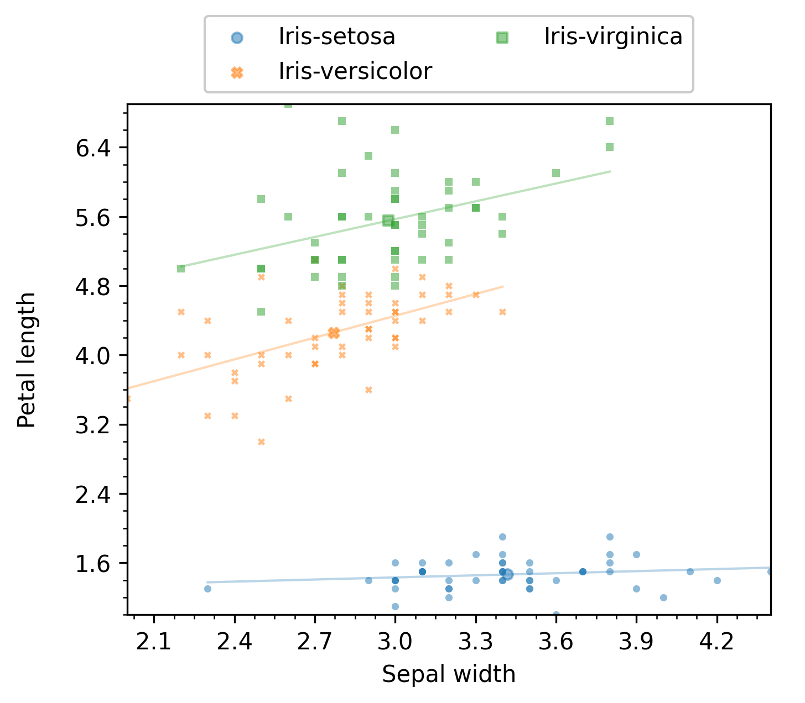

.. Analyzing data (with aanalysis.py)

.. include:: ./tag_definition.rst

Result analysis and plotting with |enb|
=======================================

The :mod:`enb.aanalysis` module provides several classes to help you analyze and
visualize your results. These classes accept |DataFrame| instances, which can
be produced by your `enb`-based scripts or imported via :meth:`pandas.read_csv`.

These classes produce:

* Plots in PDF and PNG format
* Summary tables in CSV and `.tex` format

The analysis and plotting tools are presented in the following sections, each describing
a general use case.

.. note::
    If you have |enb| already installed, you can download all the test data and example code into the `ag` folder as with

    .. code-block:: bash

        enb install analysis-gallery ag

One numeric column
------------------

In this scenario, we want to analyze a column of scalar values, typically integers and/or floats.
Here we will be using the Iris dataset, which we can load with:

.. code-block:: python

    import pandas as pd

    iris_df = pd.read_csv("./input_csv/iris_dataset.csv")

This particular dataframe has the `sepal_length`, `sepal_width`, `petal_length`, `petal_width` and `class` columns defined.
We can analyze the general petal and sepal dimensions using the **`get_df`** method of |ScalarNumericAnalyzer|

.. code-block:: python

    import enb

    analyzer = enb.aanalysis.ScalarNumericAnalyzer()
    analysis_df = analyzer.get_df(
        full_df=iris_df, target_columns=["sepal_length", "sepal_width",
                                         "petal_length", "petal_width"])

.. note::
    The target columns are selected with the **target_columns** parameter, which must be a list of
    column names present in the dataframe being analyzed.

The following render modes are available for the ScalarNumericAnalyzer (they are all rendered by default):

.. program-output:: python -c 'import enb; print("- " + "\n- ".join(enb.aanalysis.ScalarNumericAnalyzer.valid_render_modes))' | tail -n+4
    :shell:

Plots
_____
The `histogram` mode  renders a basic plot with information about the distribution, the average, and the standard deviation of the samples,
as shown in the next figure. The returned `analysis_df` dataframe contains the exact values for the mean, standard deviations,
etc., for each target column.

.. figure:: _static/analysis_gallery/ScalarNumericAnalyzer_sepal_width_groupby-None_histogram.png

The `hbar` and `boxplot` modes are most useful when
grouping -- examples are provided below in the first section about grouping below.

.. _sec_one_numeric_summary:

Summary tables
______________

When the `get_df` method of |ScalarNumericAnalyzer| is invoked,
it automatically produces summary tables at `enb.config.options.analysis_dir`.
More specifically,

* A `CSV file <_static/analysis_gallery/ScalarNumericAnalyzer-columns_sepal_length__sepal_width__petal_length__petal_width-hbar__histogram__boxplot-groupby__class.csv>`_
  with data statistics for each target column (and each group, if grouping is used):

    - arithmetic mean
    - minimum and maximum
    - standard deviation
    - median
    - number of samples

* A `.tex file <_static/analysis_gallery/ScalarNumericAnalyzer-columns_sepal_length__sepal_width__petal_length__petal_width-hbar__histogram__boxplot-groupby__class.tex>`_ with a table containing the mean values of the target columns.

Note that grouping (described in :ref:`sec_grouping`) is employed in these examples to make it a bit clearer.

Two numeric columns
-------------------

In this scenario, we want to compare two numeric columns, e.g., `sepal_width` and `petal_width`.
To do so, we need to use the |TwoNumericAnalyzer| class instead of the |ScalarNumericAnalyzer|
we employed in the previous examples.

These two, and all subclasses of |Analyzer| share a similar interface rotating around the `get_df`
method that analyzes and plots

.. code-block:: python

    two_numeric_analyzer = enb.aanalysis.TwoNumericAnalyzer()
    analysis_df = two_numeric_analyzer.get_df(
        full_df=iris_df, target_columns=[("sepal_width", "petal_length")],
        output_plot_dir=os.path.join(options.plot_dir, "scalar_numeric"),
    )

.. note::

    When using |TwoNumericAnalyzer|, the **target_columns** parameter must be a list of tuples, each
    containing two column names, e.g.: `("columnA", "columnB")`.

Plots
_____

In addition to the `analysis_df` dataframe with numeric results, this will produce a scatter plot like the following,
which also shows +/- 1 horizontal and vertical standard deviations.

.. figure:: _static/analysis_gallery/TwoNumericAnalyzer_sepal_width__petal_length_groupby-None_scatter.png

The previous figure shows an example of the `scatter` plot mode.
The following render modes are available for the TwoNumericAnalyzer (they are all rendered by default):

.. program-output:: python -c 'import enb; print("- " + "\n- ".join(enb.aanalysis.TwoNumericAnalyzer.valid_render_modes))' | tail -n+4
    :shell:

Note that, for the `scatter` plot mode, it is possible to display linear regression of the data.
For instance, the following code

.. code-block:: python

    two_numeric_analyzer = enb.aanalysis.TwoNumericAnalyzer()
    two_numeric_analyzer.show_x_std = False
    two_numeric_analyzer.show_y_std = False
    two_numeric_analyzer.show_linear_regression = True
    analysis_df = two_numeric_analyzer.get_df(
        full_df=iris_df, target_columns=[("sepal_width", "petal_length")],
        output_plot_dir=os.path.join(options.plot_dir, "styles", style, "two_numeric", "withregression"),
        group_by="class",
        style_list=[style])

will produce a figure like the following:

Additional examples are provided below in :ref:`sec_grouping`, where some of these modes are most useful.

Summary tables
______________

When the `get_df` method of |TwoNumericAnalyzer| is invoked,
it automatically produces summary tables at `enb.config.options.analysis_dir`.
More specifically,

* A `CSV file <_static/analysis_gallery/TwoNumericAnalyzer-columns_sepal_width__vs__petal_length-scatter.csv>`_
  with

    - All statistics described above in the :ref:`sec_one_numeric_summary` section for each target column.
    - For each pair of columns:
        * Pearson's correlation coefficient and its p-value
        * Spearman's correlation coefficient and its p-value
        * The linear regression slope and intercept values

* A `.tex file <_static/analysis_gallery/TwoNumericAnalyzer-columns_sepal_width__vs__petal_length-scatter.tex>`_ with a table containing the mean values of the target columns.

Columns with dictionaries
-------------------------

The |enb| library allows storing dictionaries with scalar entries. For columns with numeric values (integer or float),
the |DictNumericAnalyzer| class can be used.

In the following example, the dataset
contains a column `mode_count` where keys are the set of possible modes and the values are the number of times
each mode has been employed. We can import the dataset with the following lines

.. code-block:: python

    import pandas as pd

    hevc_df = pd.read_csv("./input_csv/hevc_frame_prediction.csv")
    ## These two lines are automatically applied
    ## by get_df of the appropriate experiment - they can be safely ignored
    hevc_df["mode_count"] = hevc_df["mode_count"].apply(
        ast.literal_eval)
    hevc_df["block_size"] = hevc_df["param_dict"].apply(
        lambda d: f"Block size {ast.literal_eval(d)['block_size']:02d}")

.. note::

    The two last lines transform the string representation of a dict stored in the `.csv` file into
    actual python dictionaries.

    When using a dataframe returned by `get_df` of |enb|, column values contain the actual dictionaries
    without needing to apply `ast` directly.

.. warning::

    If you obtained the dataframe being analyzed outside |enb|, you need to create a dictionary
    with |ColumnProperties| entries for each dictionary with something like this

    .. code-block:: python

        column_to_properties = dict(mode_count=enb.atable.ColumnProperties(
            name="mode_count",
            label="Mode index to selection count",
            has_dict_values=True))

    If you obtained it from within |enb|, your |ATable| or |Experiment| instances contain respectively
    the `column_to_properties` and `joined_column_to_properties` properties that can be used
    instead of the previous code. In this case, make sure that the `has_dict_values` is set to True in
    the corresponding column definition.

Now, we instantiate |DictNumericAnalyzer| and run its `get_df` method. The following code computes the average
count per mode for each of the selected groups (given in the `block_size` column)

.. code-block:: python

    import enb

    # Create the analyzer and plot results
    numeric_dict_analyzer = enb.aanalysis.DictNumericAnalyzer()
    analysis_df = numeric_dict_analyzer.get_df(
        full_df=hevc_df,
        target_columns=["mode_count"],
        group_by="block_size",
        column_to_properties=column_to_properties,
        group_name_order=sorted(hevc_df["block_size"].unique()),

        # Rendering options
        x_tick_label_angle=90,
        fig_width=7.5,
        fig_height=5,
        secondary_alpha=0,
        global_y_label_pos=-0.1)

.. note::

    Some additional rendering options are included here to improve presentation.
    Rendering options are discussed in a later section.

Plotting
________

The resulting figure is shown below

.. figure:: _static/analysis_gallery/DictNumericAnalyzer_mode_count_groupby-block_size_line.png

.. _grouping_by_value:

Summary tables
______________

The |DictNumericAnalyzer| class produces `CSV files <_static/analysis_gallery/DictNumericAnalyzer-columns_mode_count-line-groupby__block_size.csv>`_ with several statistics
(mean, min, max, median, standard deviation) for each key of each target column.

.. _scalar_numeric_2d_analyzer:

Analysis of numeric data in an x-y (2D) space
---------------------------------------------

The |ScalarNumeric2DAnalyzer| class allows to plot data arranged arbitrarily in the x-y plane.
It is useful to create heatmap figures.

.. note:: The |ScalarNumeric2DAnalyzer| class **cannot** handle categorical (e.g., string) x or y columns.
   In that scenario, you can consider the |ScalarNumericJointAnalyzer| class in :ref:`sec_joint_analysis`.

You will need:
    - a column with scalar numerical data (integers or float entries), e.g., `column_data`
    - two more columns with scalar numerical data
      specifying the `x` and `y` coordinates of each datapoint, e.g., `column_x` and `column_y`.

You can then invoke the `get_df` method like any other |Analyzer| subclass, with the `target_columns` argument
being a list of 3-element tuples.

In the following example of the 'colormap' render mode,
the `value` column contains the data of interest, while `x` and `y` contain the spatial
information.

.. code-block:: python

    import os
    import pandas as pd
    import enb

    # Read data from CSV - could be obtained from an ATable instance
    df_2d = pd.read_csv(os.path.join("input_csv", "2d_data_example.csv"))

    # Perform analysis
    sn2da = enb.aanalysis.ScalarNumeric2DAnalyzer()
    sn2da.bin_count = 10
    sn2da.get_df(full_df=df_2d,
                 target_columns=[("x", "y", "value")],
                 column_to_properties={
                                "value": enb.atable.ColumnProperties("value", label="Result of $f(x,y)$"),
                                "x": enb.atable.ColumnProperties("x", label="Offset in the $x$ axis"),
                                "y": enb.atable.ColumnProperties("y", label="Offset in the $y$ axis")})

Plots
_____

The resulting figure is shown next:

.. figure:: _static/analysis_gallery/ScalarNumeric2DAnalyzer-columns_x__y__fx-colormap.png

.. note:: You can configure the employed colormap by modifying your |ScalarNumeric2DAnalyzer| instance attributes,
    e.g., you can set `color_map` to any color map name accepted by matplotlib, e.g.,

    .. code-block:: python

        sn2da = enb.aanalysis.ScalarNumeric2DAnalyzer()
        sn2da.color_map = "Oranges"

    See https://matplotlib.org/stable/gallery/color/colormap_reference.html for more information about available
    colormaps.

Summary tables
______________

The |ScalarNumeric2DAnalyzer| class produces:

* `CSV files <_static/analysis_gallery/ScalarNumeric2DAnalyzer-columns_x__vs__y__vs__value-colormap-groupby__class.csv>`_
  with the same statistics as those of |ScalarNumericAnalyzer|
  (see :ref:`sec_one_numeric_summary`: min, max, mean, median, standard deviation) for each selected
  `x`, `y` and `value` column.

* `.tex files <_static/analysis_gallery/ScalarNumeric2DAnalyzer-columns_x__vs__y__vs__value-colormap-groupby__class.tex>`_ with the average of each selected `x`, `y` and `value` column.

.. _sec_joint_analysis:

Joint numeric analysis (double categorical grouping)
----------------------------------------------------

With |ScalarNumericJointAnalyzer|, it is possible to analyze scalar numeric data
jointly splitting it by two different groupings. This results in a table where the
columns correspond to one of the categories/groupings (e.g., corpus name)
and the rows to the other category/grouping (e.g., task label).
Cells correspond to the averages for the data column.

.. note:: The |ScalarNumericJointAnalyzer| supports any type for the x and y columns as long
  as `str` can be applied to them. If you want to use numeric data for x and y, consider |ScalarNumeric2DAnalyzer|
  in :ref:`scalar_numeric_2d_analyzer`.

You will need:
    - a column with scalar numerical data (integers or float entries), e.g., `column_data`
    - two more columns with categorical (e.g., string) data
      specifying the grouping along the x axis and the y axis, e.g., `column_x` and `column_y`.

In the following example of the 'table' render mode,
the `Price` column contains the data of interest, while `Color` and `Origin` contain the categorical
data for joint analysis.

.. code-block:: python

    import os
    import pandas as pd
    import enb

    df_joint = pd.read_csv(os.path.join("input_csv", "continent_data_example.csv"))

    snja = enb.aanalysis.ScalarNumericJointAnalyzer()
    snja.get_df(full_df=df_joint,
                target_columns=[("Color", "Origin", "Price")])

Plots
_____

The resulting plot, corresponding to the average value of the data column, is shown in the following figure:

.. figure:: _static/analysis_gallery/ScalarNumericJointAnalyzer-columns_Color__Origin__Price-table.png

.. note:: You can pass `fig_height`, `fig_width` or both to the `get_df` method of |ScalarNumericJointAnalyzer|
   to control the size of the displayed table.

Summary tables
______________

The |ScalarNumericJointAnalyzer| produces custom
`CSV <_static/analysis_gallery/ScalarNumericJointAnalyzer-columns_Color__vs__Origin__vs__Price-table.csv>`_
and
`CSV file <_static/analysis_gallery/ScalarNumericJointAnalyzer-columns_Color__vs__Origin__vs__Price-table.csv>`_
files corresponding to the above table.

These files contain tables for several statistics: average, min, max, standard deviation, median and count.
All these correspond to the *finite* data found for each x-category and y-category combination.

An example of LaTeX output is shown below

.. code-block:: latex

    % Column selection: 'Color' 'Origin' 'Price'
    % Statistic: avg
    \begin{tabular}{lccc}
    \toprule
                     & \textbf{Blue} & \textbf{Green} & \textbf{Red} \\
    \toprule
    \textbf{Africa}  & 1081.500 & 569.000  & 966.750  \\
    \textbf{America} & 924.000  & 325.000  & 1014.000 \\
    \textbf{Asia}    & 675.333  & 738.000  & 1044.500 \\
    \textbf{Europe}  & 498.000  & 767.500  & 723.200  \\
    \textbf{Oceania} & 660.600  & 990.667  & 1150.667 \\
    \midrule
    \textbf{All}     & 738.286  & 744.600  & 948.889  \\
    \bottomrule
    \end{tabular}

The corresponding CSV file is as follows:

.. code-block::

    # Column selection: 'Color' 'Origin' 'Price'
    ## Statistic: avg
    ### Group: 'All'
    ,Blue,Green,Red
    Africa,1081.500,569.000,966.750
    America,924.000,325.000,1014.000
    Asia,675.333,738.000,1044.500
    Europe,498.000,767.500,723.200
    Oceania,660.600,990.667,1150.667
    All,738.286,744.600,948.889

Output configuration
____________________

* You can select the order of column headers and/or row headers by passing `x_header_list`, `y_header_list`, or both
  to :meth:`enb.aanalysis.ScalarNumericJointAnalyzer.get_df`. When one is present, it must be a non-empty list
  containing strings that match exactly one or more of the existing row or column headers
  (e.g., one or more of `["Blue", "Green", "Red"]` when specifying `x_header_list` in the previous example.

* You can also disable the global "All" row by adding `show_global=False` to the `get_df`
  call of your |ScalarNumericJointAnalyzer| instance.

The following example displays both of these features (they can be used independently):

    .. code-block:: python

        import os
        import pandas as pd
        import enb

        df_joint = pd.read_csv(os.path.join("input_csv", "continent_data_example.csv"))

        snja = enb.aanalysis.ScalarNumericJointAnalyzer()
        snja.get_df(full_df=df_joint,
                    target_columns=[("Color", "Origin", "Price")],
                    # Show only these columns, in this order:
                    x_header_list=["Red", "Blue"],
                    # Show only these rows, in this order:
                    y_header_list=["Oceania", "Africa"],
                    # Hide the "All" row
                    show_global=False)

and produces the following result:

.. figure:: _static/analysis_gallery/filtered_ScalarNumericJointAnalyzer-columns_Color__Origin__Price-table.png

* You can select a column or a row as reference, by passing the `reference_group` parameter to
  :meth:`enb.aanalysis.ScalarNumericJointAnalyzer.get_df`. You can control whether the reference group is
  shown or not by modifying the `show_reference_group` of your |ScalarNumericJointAnalyzer| instance.

* You can pass `highlight_best_col="low"` or highlight_best_col="high"
  to :meth:`enb.aanalysis.ScalarNumericJointAnalyzer.get_df` to automatically highlight the best
  (lowest or highest) value in each row. Conversely, you can use `highlight_best_row="low"`
  or `highlight_best_row="high"` to highlight the best value in each column.

.. _sec_grouping:

Grouping by a column's value
----------------------------

Grouping with ScalarNumericAnalysis
___________________________________

Often, we want to group the dataframe's rows based on the value of a given column, and then analyze others.

We achieve this by passing that the grouping column's name as the **group_by** keyword
when calling ScalarNumericAnalyzer's `get_df` method.

Continuing with the Iris experiment above, we can show results grouped by `class` (present in the original `.csv`)
as follows:

.. code-block:: python

    analyzer = enb.aanalysis.ScalarNumericAnalyzer()
    analysis_df = analyzer.get_df(
        full_df=iris_df,
        target_columns=["sepal_length", "sepal_width",
                         "petal_length", "petal_width"],
        group_by="class")

By default, all of the following render modes are used with |ScalarNumericAnalyzer|:

.. program-output:: python -c 'import enb; print("- " + "\n- ".join(enb.aanalysis.ScalarNumericAnalyzer.valid_render_modes))' | tail -n+4
    :shell:

The `histogram` render mode produces plots like the following:

.. figure:: _static/analysis_gallery/ScalarNumericAnalyzer_petal_width_groupby-class_histogram.png

The `hbar` render mode produces horizontal bar plots with length equal to the average, as shown in the
following image:

.. figure:: _static/analysis_gallery/ScalarNumericAnalyzer-petal_width-hbar-groupby__class.png

The `boxplot` render mode produces standard box plots where lines span the entire input data range,
the vertical lines in the box plot indicates quartiles Q1, Q2 and Q3, and the mean value is also displayed,
as shown next:

.. figure:: _static/analysis_gallery/ScalarNumericAnalyzer-petal_length-boxplot-groupby__class.png

Grouping with other Analyzer subclasses
_______________________________________

Grouping is not restricted to |ScalarNumericAnalyzer|. It can be used with other |Analyzer| classes such as
|TwoNumericAnalyzer|, as in the following code:

.. code-block:: python

    two_numeric_analyzer = enb.aanalysis.TwoNumericAnalyzer()
    analysis_df = two_numeric_analyzer.get_df(
        full_df=iris_df, target_columns=[("sepal_width", "petal_length")],
        group_by="class",
    )

By default, all of the following render modes are used with |TwoNumericAnalyzer|:

.. program-output:: python -c 'import enb; print("- " + "\n- ".join(enb.aanalysis.TwoNumericAnalyzer.valid_render_modes))' | tail -n+4
    :shell:

The resulting plot for the `scatter` mode is shown next:

.. figure:: _static/analysis_gallery/TwoNumericAnalyzer_sepal_width__petal_length_groupby-class_scatter.png

The resulting plot for the `line` mode is shown next:

.. figure:: _static/analysis_gallery/TwoNumericAnalyzer-sepal_width__vs__petal_length-line-groupby__class.png

Grouping by task families
-------------------------

When |Experiment| is used to obtain dataframes of results, it is typical to have families
of tasks that were applied separately but are related. This can be used by defining a list
of |TaskFamily| instances and passing that argument to the `group_by` parameter of `get_df`.

For instance, for an input we might want to run algorithms A and B. Algorithm A is to be run with
two parameter configurations: A1 and A2, while algorithm B is to be run with configurations B1, B2, B3 and B4.
In this case, two families would be created, e.g., with labels "Algorithm A" and "Algorithm B",
with 2 and 4 tasks in them.

In the following figure, an example with 6 algorithms, each with different configurations
that affect their "Compressed data rate". Please see the :doc:`image_compression` page for a full
experiment that uses task families and produces plots like the one in the figure.

.. figure:: _static/lossy_experiment/TwoNumericAnalyzer_bpppc__psnr_dr_groupby-family_label_line.png

Combining groups
----------------

The `combine_groups` argument can be passed to get_df or set in the |ScalarNumericAnalyzer| instance.
If selected, all groups are shown in the same subplot. In this case, the average and standard deviation
values are automatically removed for clarity. An example of this output can be found next:

.. code-block:: python

    enb.aanalysis.ScalarNumericAnalyzer().get_df(
        full_df=iris_df,
        target_columns=["sepal_length", "sepal_width",
                        "petal_length", "petal_width"],
        group_by="class",
        output_plot_dir=os.path.join(
            options.plot_dir, "scalar_combined_groups"),
        legend_column_count=3,
        combine_groups=True,
    )

.. figure:: _static/analysis_gallery/ScalarNumericAnalyzer-petal_length-histogram-groupby__class__combine_groups.png

|

Groups are automatically combined for |TwoNumericAnalyzer|, but are optional for |DictNumericAnalyzer|.
An example is provided next:

.. figure:: _static/analysis_gallery/DictNumericAnalyzer-mode_count-line-groupby__block_size__combine_groups.png

Making baseline comparisons
---------------------------

When grouping is used, it is possible to select one of the groups as baseline and then perform
analysis and plotting on the differences against that baseline.

For the |Analyzer| subclasses and render modes that support it, it suffices to pass
`reference_group="group name"` when calling `get_df`. Here, `"group name"` is one
of the group labels derived from the `group_by` selection.

Example with |ScalarNumericAnalyzer|
____________________________________

The following snippet shows how to use the |ScalarNumericAnalyzer| to show differences against a group.

.. code-block:: python

    iris_df = pd.read_csv("./input_csv/iris_dataset.csv")
    scalar_analyzer = enb.aanalysis.ScalarNumericAnalyzer()
    analysis_df = scalar_analyzer.get_df(
        full_df=iris_df, target_columns=["sepal_length", "sepal_width", "petal_length", "petal_width"],
        group_by="class",
        reference_group="Iris-versicolor",
        output_plot_dir=os.path.join(options.plot_dir, "scalar_numeric_reference"))

The resulting plot is shown in the next figure.

.. figure:: _static/analysis_gallery/ScalarNumericAnalyzer-sepal_width-histogram-groupby__class-referencegroup__Iris-versicolor.png

You can choose whether the group used as baseline is employed or not, by setting your
analyzer instance's `show_reference_group` attribute, i.e.,

.. code-block:: python

    scalar_analyzer.show_reference_group = False

before calling `get_df`.

Note that you can combine `reference_group` and `combine_groups` if you want. An example
where both options are used is shown next:

.. code-block:: python

    scalar_analyzer.show_reference_group = False
    scalar_analyzer.get_df(
        full_df=iris_df,
        target_columns=["sepal_length", "sepal_width", "petal_length", "petal_width"],
        group_by="class",
        output_plot_dir=os.path.join(options.plot_dir, "scalar_combined_reference"),
        combine_groups=True,
        legend_column_count=3,
        reference_group="Iris-versicolor",
    )

.. figure:: _static/analysis_gallery/ScalarNumericAnalyzer-petal_length-histogram-groupby__class-referencegroup__Iris-versicolor__combine_groups.png

Example with |TwoNumericAnalyzer|
_________________________________

The |TwoNumericAnalyzer| class has a sintax similar to |ScalarNumericAnalyzer|.
Both the `line` and `scatter` render modes are available, but only one can be used per call to `get_df`.

.. code-block:: python

    two_numeric_analyzer = enb.aanalysis.TwoNumericAnalyzer()
    # scatter baseline reference
    analysis_df = two_numeric_analyzer.get_df(
        full_df=iris_df, target_columns=[("sepal_width", "petal_length")],
        output_plot_dir=os.path.join(options.plot_dir, "two_numeric_reference"),
        group_by="class", reference_group="Iris-versicolor",
        selected_render_modes=["scatter"]
    )
    # line baseline reference
    function_df = pd.read_csv("./input_csv/function.csv")
    analysis_df = two_numeric_analyzer.get_df(
        full_df=function_df, target_columns=[("sepal_width", "petal_length")],
        output_plot_dir=os.path.join(options.plot_dir, "two_numeric_reference"),
        group_by="class", reference_group="Iris-versicolor",
        selected_render_modes=["scatter"]
    )

When `scatter` is selected, the average value for the reference group is calculated for each x and y column.
Then that value is subtracted from all samples. The point cloud of the reference group is then centered
at `(0,0)` and all other groups are compared both in the x and y column to the reference.

.. figure:: _static/analysis_gallery/TwoNumericAnalyzer-sepal_width__vs__petal_length-scatter-groupby__class-referencegroup__Iris-versicolor.png

When `line` is selected, groups are expected to be x-aligned. That is, they share the same values
of the x column. The average value of the y column for each x value is subtracted from all samples at that x value.
For instance, if the x column contains values of a variable x, and the y column contains f(x), g(x), h(x),
then one can use f as the reference group, which results in plotting f(x)-f(x), g(x)-f(x) and h(x)-f(x).

.. figure:: _static/analysis_gallery/TwoNumericAnalyzer-functions-line-withreference.png

Customizing plot appearance
---------------------------

If the default plot appearance does not suit you (axis limits, font size, color scheme, logarithmic scale, etc.),
`enb` offers several ways of customizing them, described in the following subsections.

Choosing a plot type
____________________

You can change the type of plot by selecting one of the available |Analyzer| classes.
See above for examples on all available classes.

Some analyzers provide several render modes. You can select one or more of them by
passing the `selected_render_modes` argument to your `get_df` calls.
By default, all render modes in an |Analyzer| are used.

Modifying your Analyzers
________________________

The |Analyzer| classes themselves have several attributes that affect the way they
produce plots. Some examples common to all |Analyzer| instances are as follows.

.. code-block:: text

        # List of allowed rendering modes for the analyzer
        valid_render_modes = set()
        # Selected render modes (by default, all of them)
        selected_render_modes = %(valid_render_modes)s
        # If more than one group is present, they are shown in the same subplot
        # instead of in different rows
        combine_groups = False

        # If not None, it must be a list of matplotlibrc styles (names or file paths)
        style_list = None
        # Default figure width
        fig_width = 5.0
        # Default figure height
        fig_height = 4.0
        # Relative horizontal margin added to plottable data in figures, e.g. 0.1 for a 10% margin
        horizontal_margin = 0
        # Relative vertical margin added to plottable data in figures, e.g. 0.1 for a 10% margin
        vertical_margin = 0
        # Margin between group rows (None to use matplotlib's default)
        group_row_margin = None

        # Show grid lines at the major ticks?
        show_grid = False
        # Show grid lines at the minor ticks?
        show_subgrid = False
        # If applicable, show a horizontal +/- 1 standard deviation bar centered on the average
        show_x_std = False
        # If applicable, show a vertical +/- 1 standard deviation bar centered on the average
        show_y_std = False
        # If True, display group legends when applicable
        show_legend = True
        # Default number of columns inside the legend
        legend_column_count = 2
        # Legend position (if configured to be shown). It can be "title" to show it above the plot,
        # or any matplotlib-recognized argument for the loc parameter of legend()
        legend_position = "title"
        # If more than one group is displayed, when applicable, adjust plots to use the same scale in every subplot?
        common_group_scale = True

        # Main title to be displayed
        plot_title = None
        # Show the number of elements in each group?
        show_count = True
        # Show a group containing all elements?
        show_global = False
        # If a reference group is used as baseline, should it be shown in the analysis itself?
        show_reference_group = True

        # Main marker size
        main_marker_size = 4
        # Secondary (e.g., individual data) marker size
        secondary_marker_size = 2
        # Thickness of secondary plot lines
        secondary_line_width = 1
        # Main plot element alpha
        main_alpha = 0.5
        # Thickness of the main plot lines
        main_line_width = 2
        # Secondary plot element alpha (often overlaps with data using main_alpha)
        secondary_alpha = 0.3
        # If a semilog y axis is used, y_min will be at least this large to avoid math domain errors
        semilog_y_min_bound = 1e-5

        # Number of decimals used when showing decimal values in latex
        latex_decimal_count = 3

Default values for these attributes can be set by placing a file with `.ini` extension
in your project root (where your scripts are placed). This file should contain a subset
of the attributes defined in the
`full enb.ini configuration file <https://github.com/miguelinux314/experiment-notebook/blob/dev/enb/config/enb.ini>`_.

.. note:: Attributes must be stored in sections with name given by the |Analyzer| class, e.g.,
    `'[enb.aanalysis.Analyzer]'` or `'[enb.aanalysis.ScalarNumericAnalyzer]'`.

You can install a copy of the full configuration file and then modify it as needed with:

    .. code-block:: bash

        enb plugin install enb.ini ./your_project_folder/

Once an |Analyzer| has been instantiated, its attributes can be modified like any other object.
Attribute values are independently read for each call to `get_df`.

.. _column_hints:

Setting column plotting hints
_____________________________

All columns defined in |ATable| subclasses (including |Experiment| subclasses)
have a corresponding |ColumnProperties| instance.

These instances contain rendering hints when plotting that column such as:

- axis labels (e.g., `label='Average duration (s)'`)
- plot limits (e.g., `plot_min=0`, `plot_max=60`, which can also be set to None for automatic limits)
- axis type (e.g., `semilog_x=True`)

As detailed in :doc:`basic_workflow`, these hints can be set when defining custom columns, e.g.,

.. code-block:: python

    class MyTable(enb.atable.ATable):
        @enb.atable.column_function(enb.atable.ColumnProperties(
            name="average_duration_seconds",
            label="Average duration (s)",
            plot_min=0,
            plot_max=60))
        def set_average_duration_seconds(self, file_path, row):
            row[_column_name] = # ... your code here

One can then pass the `column_to_properties` argument to an Analyzer's `get_df` method, e.g.,

.. code-block:: python

    mt = MyTable()
    df = # ... e.g., mt.get_df(), see examples above
    enb.aanalysis.ScalarNumericAnalyzer().get_df(
        full_df=df,
        column_to_properties=mt.column_to_properties)

See :meth:`enb.atable.ColumnProperties.__init__` for full details on all available attributes.

.. note::

    * You can modify |ColumnProperties| instances after they have been associated to a column, e.g.,

      .. code-block:: python

         mt.column_properties["average_duration_seconds"].plot_max = 30

    * You can create your own dictionary indexed by column name, containing |ColumnProperties| instances,
      and then pass it to `get_df`, e.g.,:

      .. code-block:: python

         enb.aanalysis.ScalarNumericAnalyzer().get_df(
            full_df=df,
            column_to_properties=dict(average_duration_seconds=enb.atable.ColumnProperties(
                plot_min=0, plot_max=30, label=r"$\Gamma$ routine execution time (seconds)")))

    * |Experiment| subclasses also offer the `joined_column_to_properties` property, which
       contains the columns defined in that experiment, and in the |ATable| subclass employed
       for the dataset (see :doc:`experiments` for more information about experiments), e.g.:

      .. code-block:: python

            # Initialize and run experiment
            exp = MyExperimentClass()
            df = exp.get_df()

            # Analyze results
            scalar_columns = ["column_A", "column_B"]
            scalar_analyzer = enb.aanalysis.ScalarNumericAnalyzer()
            scalar_analyzer.get_df(
                full_df=df,  target_columns=scalar_columns,
                group_by="task_label",  selected_render_modes={"histogram"},

                # Experiments offer the `joined_column_to_properties` property
                column_to_properties=exp.joined_column_to_properties,
            )

.. _kwargs:

Setting `**render_kwargs` when calling `Analyzer.get_df`
________________________________________________________

The `get_df` method of all |Analyzer| subclasses accept a `**render_kwargs` parameter.

.. note:: Values passed in this parameter overwrite those defined in `column_properties`.

You can add one or more `key=value` arguments to the `get_df` call, as shown in the following example.

.. code-block:: python

    numeric_dict_analyzer = enb.aanalysis.DictNumericAnalyzer()
    hevc_df = pd.read_csv("./input_csv/hevc_frame_prediction.csv")
    numeric_dict_analyzer.secondary_alpha = 0
    analysis_df = numeric_dict_analyzer.get_df(
        full_df=hevc_df,
        target_columns=["mode_count"],
        group_by="block_size",
        column_to_properties=column_to_properties,
        group_name_order=sorted(hevc_df["block_size"].unique()),

        # Rendering options
        x_tick_label_angle=90,
        fig_width=7.5,
        fig_height=5,
        global_y_label_pos=-0.01)

Here, the labels of the x ticks are rotated 90 degrees, the figure dimensions are changed, and the global y
axis label is moved to account for very long y-axis labels.

Please refer to :meth:`enb.plotdata.render_plds_by_group` for a list of all available parameters.
Note that the `pds_by_group_name` parameter and others are automatically set by your choice of |Analyzer| subclass.

.. _styles:

Using styles
____________

The `enb` library employs `matplotlib` for plotting.
Matplotlib's `styling features <https://matplotlib.org/stable/tutorials/introductory/customizing.html>`_
are available in two ways:

1. You can set the `style_list` attribute of your |Analyzer| subclass (default value or instance attribute).

2. You can pass the `style_list` argument to the call to `get_df` of your |Analyzer| subclass.

For instance, to set Matlplotlib's dark style, the following code can be used:

.. code-block:: python

    ## Option 1: modify analyzer instance
    scalar_analyzer = enb.aanalysis.ScalarNumericAnalyzer()
    scalar_analyzer.style_list = ["dark_background"]
    analysis_df = scalar_analyzer.get_df(
        full_df=iris_df, target_columns=["sepal_length", "sepal_width", "petal_length", "petal_width"],
        output_plot_dir=os.path.join(options.plot_dir, "scalar_numeric_dark", "instance"),
        group_by="class")

    ## Option 2: use get_df's **kwargs
    scalar_analyzer = enb.aanalysis.ScalarNumericAnalyzer()
    analysis_df = scalar_analyzer.get_df(
        full_df=iris_df, target_columns=["sepal_length", "sepal_width", "petal_length", "petal_width"],
        output_plot_dir=os.path.join(options.plot_dir, "scalar_numeric_dark", "kwargs"),
        group_by="class",
        style_list=["dark_background"])

Each element in `style_list` must be one of the following:

* One of Matplotlib's style names (e.g., `"dark_background", "bmh", etc) configured in your machine.
  You can check out the `gallery of matplotlib's default styles <https://matplotlib.org/stable/gallery/style_sheets/style_sheets_reference.html>`_.

* One of enb's predefined style names.

  .. note:: You can get a list of all available style names from the CLI with

      .. code-block:: bash

            enb show styles

      or within python with

      .. code-block:: python

            enb.plotdata.get_available_styles()

      An example output is as follows:

        .. program-output:: enb show styles | tail -n+3
            :shell:

* The path of a matplotlib rc style.

  See `matplotlib's rc file documentation <https://matplotlib.org/stable/tutorials/introductory/customizing.html#the-matplotlibrc-file>`_
  for more information on how to create and modify this type of files.

  You can install an editable copy of Matplotlib's default rc file with:

    .. code-block:: bash

        enb plugin install matplotlibrc .

.. note:: You can select any number of styles for your plots.
    When a list of styles is used for a plot, its elements are processed from left to right.
    Therefore, you can compose themes just like one would in
    Matplotlib `<https://matplotlib.org/stable/tutorials/introductory/customizing.html#composing-styles>`_.

.. warning:: Not all styles are necessarily intended for professional usage (-:

    .. figure:: _static/analysis_gallery/ScalarNumericAnalyzer-petal_length-histogram-groupby__class__xkcd.png
